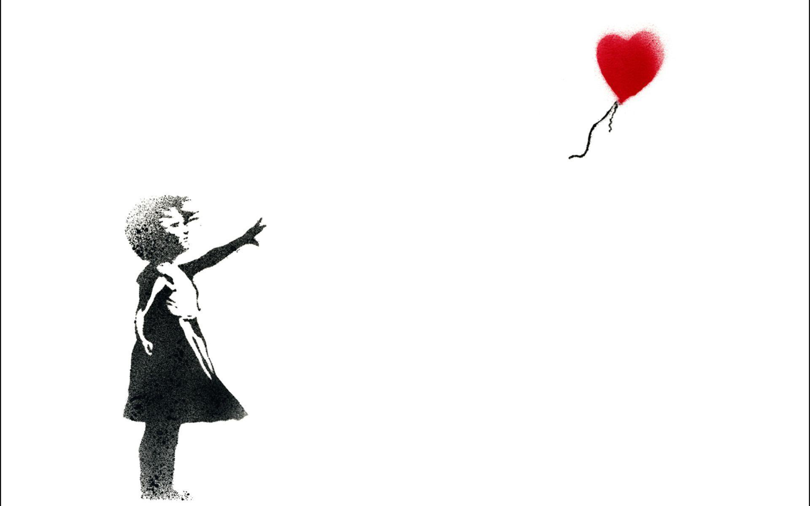

# Banksy Wall

## A dynamic Banksy inspired wallpaper for Linux

1) Clone the banksy-wall repo into`~/Pictures/wallpapers`:
`git clone https://github.com/timscodebase/banksy-wall.git banksy` 
2)
  - GNOME: Use gnome-tweaks tool to select this XML as wallpaper (as default wallpaper settings won't let you choose wallpaper from custom path)
  - MATE: Go to background setting (in Appearance) > Choose +Add... > make sure **All files** filter is selected at the bottom right > Then choose mojave.xml
